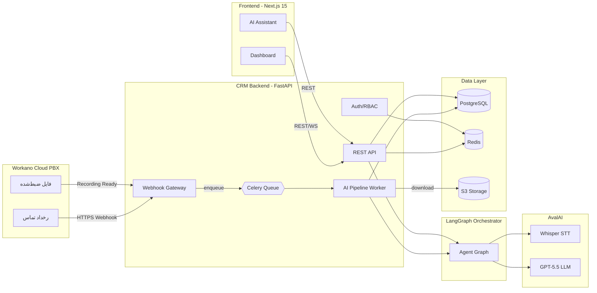
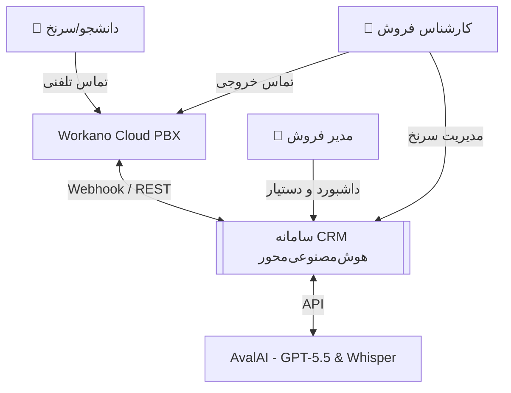
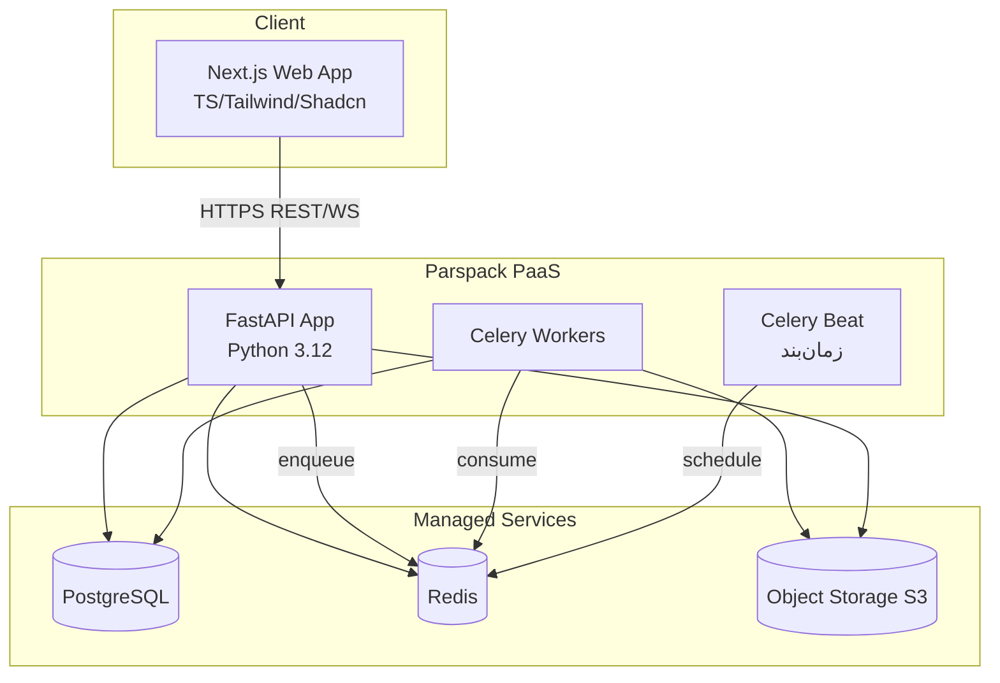
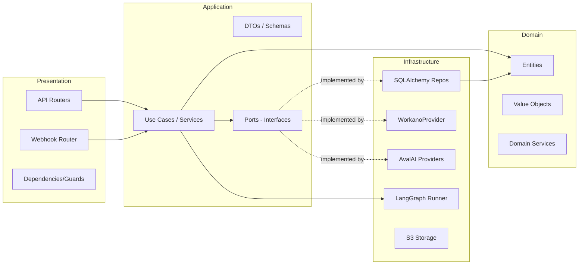

# معماری پلتفرم CRM هوش‌مصنوعی‌محور برای مؤسسات آموزشی

> سند مرجع معماری | نسخه ۱.۰ | زبان فارسی | سطح: Production-Grade SaaS

این سند، معماری کاملِ پلتفرم را پوشش می‌دهد. اسناد تکمیلی:
- [`01-DATABASE.md`](01-DATABASE.md) — اسکیمای کامل PostgreSQL و ERD
- [`02-LANGGRAPH.md`](02-LANGGRAPH.md) — طراحی گراف ایجنت‌ها و State Models
- [`03-API.md`](03-API.md) — طراحی کامل REST API
- [`04-WORKANO.md`](04-WORKANO.md) — یکپارچه‌سازی تلفنی Workano
- [`05-AVALAI.md`](05-AVALAI.md) — یکپارچه‌سازی AvalAI (GPT-5.5 / Whisper)
- [`06-SECURITY.md`](06-SECURITY.md) — معماری امنیت
- [`07-DEPLOYMENT.md`](07-DEPLOYMENT.md) — استقرار روی Parspack و CI/CD
- [`08-ROADMAP.md`](08-ROADMAP.md) — نقشه‌راه MVP، Production و مقیاس‌پذیری

---

## ۱. چشم‌انداز و اصول طراحی

### ۱.۱ هدف محصول
ساخت یک **CRM هوش‌مصنوعی‌محور (AI-Native)** برای مؤسسات آموزشی ایران که به‌صورت خودکار:
- تماس‌های ورودی/خروجی/از‌دست‌رفته را ردیابی می‌کند،
- فایل‌های ضبط‌شده را ذخیره و تحلیل می‌کند،
- اطلاعات دانشجو/سرنخ را از مکالمه استخراج می‌کند،
- مرحله‌ی فروش (Sales Stage) را تشخیص می‌دهد،
- امتیاز سرنخ (Lead Score) و احتمال ثبت‌نام را محاسبه می‌کند،
- بهترین اقدام بعدی (Next Best Action) را پیشنهاد می‌دهد،
- و به‌عنوان دستیار، مدیران فروش را پشتیبانی می‌کند.

### ۱.۲ اصول معماری (Architecture Principles)
| اصل | کاربرد در این پروژه |
|---|---|
| **Clean Architecture** | چهار لایه: Domain → Application → Infrastructure → Presentation. وابستگی‌ها فقط به‌سمت داخل. |
| **Domain-Driven Design** | Bounded Contextها: Identity، CRM، Telephony، AI Analysis، Analytics. |
| **SOLID** | تزریق وابستگی (DI)، اینترفیس‌محوری، تک‌مسئولیتی بودن هر سرویس. |
| **Provider Abstraction** | Telephony و AI پشت اینترفیس‌ها → قابل‌تعویض بدون تغییر دامنه. |
| **Async-First** | FastAPI + SQLAlchemy Async + Celery برای کارهای سنگین. |
| **Event-Driven** | Webhook → Queue → Worker → DB → WebSocket/Dashboard. |
| **12-Factor** | پیکربندی از طریق Environment، بدون state محلی، لاگ به stdout. |

### ۱.۳ چرا این انتخاب‌ها (خلاصه‌ی Tradeoffها)
- **بدون Docker، استقرار روی Parspack PaaS** → استفاده از buildpack پایتون/نود؛ سرویس‌های جانبی (PostgreSQL/Redis/Object Storage) به‌صورت Managed از Parspack.
- **Modular Monolith به‌جای Microservices در MVP** → هزینه‌ی عملیاتی پایین‌تر، سرعت توسعه بالاتر؛ مرزهای ماژول‌ها طوری طراحی شده که در آینده قابل جداسازی به سرویس مستقل باشند (مسیر مهاجرت در [`08-ROADMAP.md`](08-ROADMAP.md)).
- **Celery + Redis** برای پردازش async تماس‌ها (دانلود فایل، STT، LLM) تا Webhook سریع `200 OK` برگرداند.

---

## ۲. معماری سطح‌بالا (High-Level)



**جریان اصلی پردازش تماس:**
`Workano → Webhook → CRM Backend → (Celery) AI Processing → PostgreSQL → Dashboard`

---

## ۳. معماری C4

### ۳.۱ سطح ۱ — Context



### ۳.۲ سطح ۲ — Containers



### ۳.۳ سطح ۳ — Components (داخل FastAPI App)



---

## ۴. ساختار لایه‌ای (Clean Architecture)

وابستگی‌ها همیشه به‌سمت **داخل** (Domain) جاری‌اند. لایه‌های بیرونی به اینترفیس‌های لایه‌های داخلی وابسته‌اند، نه برعکس.

```
Presentation  ──▶  Application  ──▶  Domain  ◀──  Infrastructure
   (FastAPI)        (Use Cases)     (Entities)    (DB, AI, PBX)
                          │                              │
                          └────────  Ports  ◀────────────┘
                                  (Interfaces)
```

| لایه | مسئولیت | نمونه‌محتوا |
|---|---|---|
| **Domain** | منطق کسب‌وکار خالص، بدون وابستگی به فریم‌ورک | `Student`, `Call`, `LeadScore`, `SalesStage`, قوانین امتیازدهی |
| **Application** | هماهنگی Use Caseها، تعریف Ports (اینترفیس‌ها) | `AnalyzeCallUseCase`, `LLMProvider`, `TelephonyProvider`, `StudentRepository` |
| **Infrastructure** | پیاده‌سازی Portها | `SqlAlchemyStudentRepository`, `WorkanoProvider`, `AvalAILLMProvider`, `S3Storage`, `LangGraph` |
| **Presentation** | ورودی/خروجی HTTP، احراز هویت، اعتبارسنجی | Routerها، Pydantic Schemas، Webhook handlers |
| **Shared** | ابزارهای مشترک | Config، Logging، Exceptions، Security utils |

> قانون طلایی: Domain هیچ‌چیزی از FastAPI/SQLAlchemy/AvalAI **نمی‌داند**.

---

## ۵. ماژول‌ها (Bounded Contexts)

| ماژول | مسئولیت | وابستگی‌های بیرونی |
|---|---|---|
| **identity** | کاربران، نقش‌ها، مجوزها، JWT، RBAC | Redis (refresh tokens) |
| **crm** | دانشجو، دوره، یادداشت، تگ، فعالیت، پایپ‌لاین فروش | PostgreSQL |
| **telephony** | تماس‌ها، ضبط‌ها، Webhook، Provider abstraction | Workano، S3 |
| **ai_analysis** | پایپ‌لاین LangGraph، STT، LLM، استخراج اطلاعات، امتیازدهی | AvalAI، Celery |
| **analytics** | داشبورد، قیف فروش، عملکرد تیم، KPIها | PostgreSQL (read models) |
| **assistant** | دستیار چت CRM (NL→Query) | LLM + crm/analytics |

هر ماژول دارای `domain/`، `application/`، `infrastructure/`، `api/` مستقل است (ساختار کامل در [`backend/README.md`](../backend/README.md)).

---

## ۶. تصمیمات فنی و Tradeoffها (خلاصه)

| تصمیم | گزینه‌ها | انتخاب | دلیل |
|---|---|---|---|
| سبک معماری | Microservices / Modular Monolith | **Modular Monolith** | سرعت MVP، هزینه‌ی عملیاتی پایین روی PaaS، مرزهای آماده برای جداسازی |
| ORM | SQLAlchemy / Tortoise / Prisma | **SQLAlchemy 2.0 Async** | بلوغ، Alembic، اکوسیستم |
| پردازش async | FastAPI BackgroundTasks / Celery | **Celery + Redis** | retry، صف، مانیتورینگ، تحمل بار پردازش AI |
| ارکستراسیون AI | کد دستی / LangGraph | **LangGraph** | مدیریت state، edge شرطی، retry، مشاهده‌پذیری |
| استقرار | Docker / PaaS Buildpack | **Parspack Buildpack** | الزام پروژه (بدون Docker) |
| Realtime داشبورد | Polling / WebSocket | **WebSocket + Polling fallback** | تجربه‌ی Realtime با fallback ساده |
| امنیت Webhook | بدون امضا / HMAC | **HMAC Signature + IP allowlist** | جلوگیری از جعل رخداد |

جزئیات کامل هر تصمیم در انتهای اسناد مرتبط آورده شده است.

---

## ۷. خلاصه‌ی استک فناوری

```
Backend : Python 3.12 · FastAPI · SQLAlchemy 2.0 (async) · Alembic · Pydantic v2
AI      : LangGraph · LangChain · AvalAI GPT-5.5 · AvalAI Whisper
Async   : Celery · Redis
Data    : PostgreSQL 16 · S3-compatible Object Storage
Frontend: Next.js 15 (App Router) · React 19 · TypeScript · TailwindCSS · Shadcn UI · TanStack Query
Auth    : JWT (access) + Refresh Tokens (rotation) · RBAC
DevOps  : GitHub · GitHub Actions · Parspack PaaS
```
