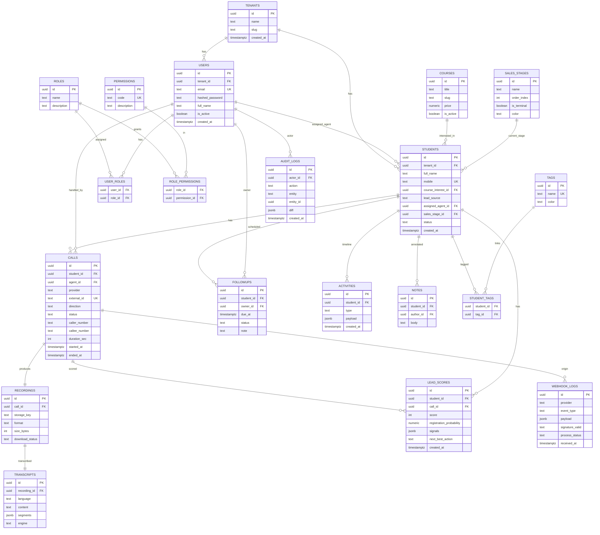

# طراحی پایگاه‌داده PostgreSQL — اسکیمای کامل و ERD

> نسخه ۱.۰ | موتور: PostgreSQL 16 | تمام جدول‌ها با `created_at`/`updated_at` و حذف نرم (`deleted_at`) در صورت نیاز.

## ۱. اصول طراحی دیتابیس
- **کلید اصلی:** `UUID` (نوع `uuid` با `gen_random_uuid()`) برای جلوگیری از افشای ترتیب و سهولت در sharding آینده.
- **زمان‌ها:** `timestamptz` (UTC). نمایش به وقت محلی در لایه‌ی Presentation.
- **تایم‌استمپ‌ها:** هر جدول `created_at`, `updated_at`؛ جداول کاربردی `deleted_at` (Soft Delete).
- **شماره موبایل:** نرمال‌سازی به فرمت `+98...` و `UNIQUE` در سطح مؤسسه (Multi-tenant آینده).
- **ENUMها:** برای وضعیت‌ها از نوع `text` + `CHECK` یا جدول مرجع استفاده می‌شود (انعطاف برای مراحل سفارشی).
- **Multi-Tenancy:** ستون `tenant_id` در جداول اصلی برای پشتیبانی چند مؤسسه‌ای (در MVP می‌تواند تک‌مقدار باشد).
- **ایندکس‌گذاری:** بر روی FKها، ستون‌های جستجو (موبایل، وضعیت)، و ستون‌های زمانی پرکوئری.

---

## ۲. نمودار ERD



---

## ۳. شرح جدول‌ها

| جدول | توضیح | ایندکس‌های کلیدی |
|---|---|---|
| `tenants` | مؤسسه (Multi-tenant) | `slug` |
| `users` | کاربران سیستم (کارشناس/مدیر/ادمین) | `email`, `tenant_id` |
| `roles` / `permissions` / `role_permissions` / `user_roles` | RBAC | `code` |
| `students` | سرنخ/دانشجو | `mobile`, `assigned_agent_id`, `sales_stage_id`, `status` |
| `courses` | دوره‌ها | `slug` |
| `sales_stages` | مراحل قیف فروش (سفارشی) | `order_index` |
| `calls` | تماس‌ها (ورودی/خروجی/ازدست‌رفته) | `external_id`, `student_id`, `started_at` |
| `recordings` | فایل ضبط‌شده (متادیتا + کلید S3) | `call_id` |
| `transcripts` | متن پیاده‌شده + Segmentها | `recording_id` |
| `lead_scores` | امتیاز سرنخ، احتمال ثبت‌نام، NBA | `student_id`, `call_id` |
| `followups` | پیگیری‌ها | `due_at`, `owner_id`, `status` |
| `activities` | تایم‌لاین فعالیت | `student_id`, `created_at` |
| `notes` | یادداشت‌ها | `student_id` |
| `tags` / `student_tags` | برچسب‌ها | `name` |
| `webhook_logs` | لاگ کامل Webhookها (Idempotency + audit) | `provider`, `event_type`, `received_at` |
| `audit_logs` | ردپای تغییرات | `actor_id`, `entity`, `created_at` |

---

## ۴. DDL کامل (PostgreSQL)

اسکریپت کامل در فایل [`backend/sql/schema.sql`](../backend/sql/schema.sql) قرار دارد و توسط Alembic مدیریت می‌شود. خلاصه‌ی مهم‌ترین جدول‌ها:

```sql
CREATE EXTENSION IF NOT EXISTS "pgcrypto"; -- gen_random_uuid

-- مراحل فروش (قابل سفارشی‌سازی)
CREATE TABLE sales_stages (
    id          uuid PRIMARY KEY DEFAULT gen_random_uuid(),
    tenant_id   uuid NOT NULL,
    name        text NOT NULL,
    order_index int  NOT NULL,
    is_terminal boolean NOT NULL DEFAULT false,
    color       text DEFAULT '#888888',
    created_at  timestamptz NOT NULL DEFAULT now(),
    UNIQUE (tenant_id, name)
);

-- دانشجو/سرنخ
CREATE TABLE students (
    id                 uuid PRIMARY KEY DEFAULT gen_random_uuid(),
    tenant_id          uuid NOT NULL,
    full_name          text,
    mobile             text NOT NULL,
    course_interest_id uuid REFERENCES courses(id) ON DELETE SET NULL,
    lead_source        text,
    assigned_agent_id  uuid REFERENCES users(id) ON DELETE SET NULL,
    sales_stage_id     uuid REFERENCES sales_stages(id) ON DELETE SET NULL,
    status             text NOT NULL DEFAULT 'active',
    created_at         timestamptz NOT NULL DEFAULT now(),
    updated_at         timestamptz NOT NULL DEFAULT now(),
    deleted_at         timestamptz,
    CONSTRAINT uq_student_mobile UNIQUE (tenant_id, mobile)
);
CREATE INDEX ix_students_agent ON students(assigned_agent_id);
CREATE INDEX ix_students_stage ON students(sales_stage_id);
CREATE INDEX ix_students_status ON students(status) WHERE deleted_at IS NULL;

-- تماس‌ها
CREATE TABLE calls (
    id            uuid PRIMARY KEY DEFAULT gen_random_uuid(),
    tenant_id     uuid NOT NULL,
    student_id    uuid REFERENCES students(id) ON DELETE SET NULL,
    agent_id      uuid REFERENCES users(id) ON DELETE SET NULL,
    provider      text NOT NULL DEFAULT 'workano',
    external_id   text NOT NULL,
    direction     text NOT NULL CHECK (direction IN ('inbound','outbound')),
    status        text NOT NULL CHECK (status IN ('ringing','answered','missed','finished','failed')),
    caller_number text,
    callee_number text,
    duration_sec  int DEFAULT 0,
    started_at    timestamptz,
    ended_at      timestamptz,
    created_at    timestamptz NOT NULL DEFAULT now(),
    CONSTRAINT uq_call_external UNIQUE (provider, external_id)
);
CREATE INDEX ix_calls_student ON calls(student_id);
CREATE INDEX ix_calls_started ON calls(started_at DESC);

-- ضبط‌ها و متن
CREATE TABLE recordings (
    id              uuid PRIMARY KEY DEFAULT gen_random_uuid(),
    call_id         uuid NOT NULL UNIQUE REFERENCES calls(id) ON DELETE CASCADE,
    storage_key     text,
    format          text DEFAULT 'mp3',
    size_bytes      int,
    download_status text NOT NULL DEFAULT 'pending'
                    CHECK (download_status IN ('pending','downloaded','failed')),
    created_at      timestamptz NOT NULL DEFAULT now()
);

CREATE TABLE transcripts (
    id            uuid PRIMARY KEY DEFAULT gen_random_uuid(),
    recording_id  uuid NOT NULL UNIQUE REFERENCES recordings(id) ON DELETE CASCADE,
    language      text DEFAULT 'fa',
    content       text,
    segments      jsonb,
    engine        text DEFAULT 'avalai-whisper',
    created_at    timestamptz NOT NULL DEFAULT now()
);

-- امتیاز سرنخ
CREATE TABLE lead_scores (
    id                       uuid PRIMARY KEY DEFAULT gen_random_uuid(),
    student_id               uuid NOT NULL REFERENCES students(id) ON DELETE CASCADE,
    call_id                  uuid REFERENCES calls(id) ON DELETE SET NULL,
    score                    int NOT NULL CHECK (score BETWEEN 0 AND 100),
    registration_probability numeric(4,3) CHECK (registration_probability BETWEEN 0 AND 1),
    signals                  jsonb,
    next_best_action         text,
    created_at               timestamptz NOT NULL DEFAULT now()
);
CREATE INDEX ix_lead_scores_student ON lead_scores(student_id, created_at DESC);

-- پیگیری‌ها
CREATE TABLE followups (
    id         uuid PRIMARY KEY DEFAULT gen_random_uuid(),
    student_id uuid NOT NULL REFERENCES students(id) ON DELETE CASCADE,
    owner_id   uuid REFERENCES users(id) ON DELETE SET NULL,
    due_at     timestamptz NOT NULL,
    status     text NOT NULL DEFAULT 'pending'
               CHECK (status IN ('pending','done','overdue','cancelled')),
    note       text,
    created_at timestamptz NOT NULL DEFAULT now()
);
CREATE INDEX ix_followups_due ON followups(due_at) WHERE status = 'pending';

-- لاگ Webhook (Idempotency)
CREATE TABLE webhook_logs (
    id              uuid PRIMARY KEY DEFAULT gen_random_uuid(),
    provider        text NOT NULL,
    event_type      text NOT NULL,
    external_id     text,
    payload         jsonb NOT NULL,
    signature_valid boolean,
    process_status  text NOT NULL DEFAULT 'received'
                    CHECK (process_status IN ('received','processing','done','failed','duplicate')),
    received_at     timestamptz NOT NULL DEFAULT now(),
    CONSTRAINT uq_webhook_event UNIQUE (provider, event_type, external_id)
);

-- ردپای حسابرسی
CREATE TABLE audit_logs (
    id         uuid PRIMARY KEY DEFAULT gen_random_uuid(),
    actor_id   uuid REFERENCES users(id) ON DELETE SET NULL,
    action     text NOT NULL,
    entity     text NOT NULL,
    entity_id  uuid,
    diff       jsonb,
    ip         inet,
    created_at timestamptz NOT NULL DEFAULT now()
);
CREATE INDEX ix_audit_entity ON audit_logs(entity, entity_id);
```

---

## ۵. بهینه‌سازی عملکرد
- **Partitioning** جدول `calls` و `audit_logs` بر اساس ماه (`started_at`/`created_at`) برای داده‌ی انبوه.
- **Materialized View** برای داشبورد (تعداد تماس‌ها، نرخ تبدیل) با Refresh دوره‌ای از طریق Celery Beat.
- **Partial Index** روی سرنخ‌های فعال و پیگیری‌های pending (نمونه بالا).
- **JSONB GIN Index** روی `lead_scores.signals` و `transcripts.segments` برای کوئری‌های دستیار AI.
- **Connection Pooling** با `asyncpg` + `pool_size` تنظیم‌شده برای محیط PaaS.

> جزئیات مقیاس‌پذیری برای ۱۰۰٬۰۰۰+ دانشجو در [`08-ROADMAP.md`](08-ROADMAP.md).
