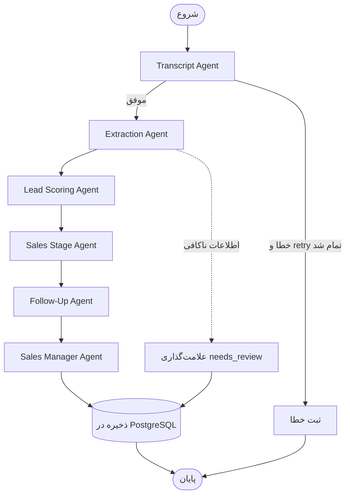

# طراحی LangGraph — ارکستراسیون ایجنت‌های هوش‌مصنوعی

> نسخه ۱.۰ | LangGraph + LangChain | مدل: AvalAI GPT-5.5 و Whisper

## ۱. هدف
پس از هر تماس، یک گراف از ایجنت‌ها اجرا می‌شود تا از فایل صوتی تا «بهترین اقدام بعدی» را به‌صورت
خودکار و قابل‌اعتماد تولید کند. خروجی نهایی، JSON ساختاریافته‌ای است که در CRM ذخیره می‌شود.

## ۲. ایجنت‌ها (Nodes)

| ایجنت | ورودی | خروجی | مدل |
|---|---|---|---|
| **Transcript Agent** | فایل صوتی (S3 key) | متن پیاده‌شده + Segments | Whisper |
| **Extraction Agent** | متن | اطلاعات کسب‌وکاری (نام، دوره، هدف، اعتراض‌ها، بودجه، فوریت، سیگنال خرید) | GPT-5.5 |
| **Lead Scoring Agent** | اطلاعات استخراج‌شده + تاریخچه | امتیاز ۰-۱۰۰ + احتمال ثبت‌نام | GPT-5.5 |
| **Sales Stage Agent** | اطلاعات + امتیاز | مرحله‌ی فروش پیشنهادی | GPT-5.5 |
| **Follow-Up Agent** | همه‌ی موارد بالا | تاریخ پیگیری + نوع اقدام | GPT-5.5 |
| **Sales Manager Agent** | خلاصه‌ی کامل | خلاصه‌ی مدیریتی + Next Best Action | GPT-5.5 |

## ۳. مدل State (LangGraph State)

```python
from typing import TypedDict, Optional, Literal
from pydantic import BaseModel

class ExtractedInfo(BaseModel):
    full_name: Optional[str] = None
    course_name: Optional[str] = None
    educational_goal: Optional[str] = None
    registration_intention: Optional[Literal["high", "medium", "low", "none"]] = None
    objections: list[str] = []
    budget_concern: Optional[bool] = None
    preferred_followup_date: Optional[str] = None       # ISO date
    urgency: Optional[Literal["high", "medium", "low"]] = None
    purchase_signals: list[str] = []

class CallAnalysisState(TypedDict, total=False):
    # ورودی
    call_id: str
    recording_key: str
    student_id: Optional[str]
    history: list[dict]                  # تماس‌ها/امتیازهای قبلی

    # مراحل
    transcript: Optional[str]
    segments: Optional[list[dict]]
    extracted: Optional[ExtractedInfo]
    lead_score: Optional[int]
    registration_probability: Optional[float]
    suggested_stage: Optional[str]
    followup_date: Optional[str]
    next_best_action: Optional[str]
    manager_summary: Optional[str]

    # کنترل خطا
    errors: list[str]
    retries: dict[str, int]
    status: Literal["running", "completed", "failed"]
```

## ۴. گراف (Nodes + Edges)



### Edgeهای شرطی
- بعد از **Transcript**: اگر متن خالی/کوتاه بود → مسیر `needs_review` (بدون اتلاف توکن روی استخراج).
- بعد از **Extraction**: اگر اعتماد مدل پایین بود → علامت `needs_review` ولی ادامه‌ی امتیازدهی.
- بعد از هر نود: اگر خطا رخ داد و `retries < MAX` → اجرای مجدد همان نود (با backoff).

## ۵. مدیریت خطا و استراتژی Retry

| لایه | استراتژی |
|---|---|
| **Node-level** | هر نود حداکثر ۳ بار با Exponential Backoff (1s, 4s, 9s). شکست → ثبت در `errors` و عبور با مقدار `None`. |
| **Graph-level** | اگر نود حیاتی (Transcript/Extraction) کاملاً شکست خورد → state با `status="failed"` ذخیره و Celery task برای retry بعدی زمان‌بندی می‌شود. |
| **Idempotency** | کلید اجرا = `call_id`؛ اجرای مجدد، نتایج قبلی را بازنویسی نمی‌کند مگر `force=True`. |
| **Timeout** | هر فراخوانی AvalAI با timeout (۶۰s برای LLM، ۱۲۰s برای Whisper). |
| **Fallback مدل** | اگر GPT-5.5 خطای ظرفیت داد → fallback به مدل سبک‌تر AvalAI با همان interface. |
| **Structured Output** | همه‌ی نودهای LLM با `with_structured_output(PydanticModel)` تا خروجی JSON معتبر تضمین شود. |

## ۶. اجرای گراف (نمونه)

```python
from langgraph.graph import StateGraph, START, END

def build_call_analysis_graph(llm, stt, repo):
    g = StateGraph(CallAnalysisState)
    g.add_node("transcript", make_transcript_node(stt))
    g.add_node("extract", make_extraction_node(llm))
    g.add_node("score", make_scoring_node(llm))
    g.add_node("stage", make_stage_node(llm))
    g.add_node("followup", make_followup_node(llm))
    g.add_node("manager", make_manager_node(llm))
    g.add_node("persist", make_persist_node(repo))

    g.add_edge(START, "transcript")
    g.add_conditional_edges("transcript", route_after_transcript,
                            {"continue": "extract", "review": "persist"})
    g.add_edge("extract", "score")
    g.add_edge("score", "stage")
    g.add_edge("stage", "followup")
    g.add_edge("followup", "manager")
    g.add_edge("manager", "persist")
    g.add_edge("persist", END)
    return g.compile()
```

> پیاده‌سازی کامل نودها در [`backend/src/modules/ai_analysis/infrastructure/langgraph/`](../backend/src/modules/ai_analysis/).

## ۷. نمونه خروجی نهایی (JSON ساختاریافته)

```json
{
  "call_id": "8f2c...",
  "extracted": {
    "full_name": "سارا محمدی",
    "course_name": "پایتون مقدماتی",
    "educational_goal": "ورود به بازار کار برنامه‌نویسی",
    "registration_intention": "high",
    "objections": ["شهریه بالا", "زمان کلاس‌ها"],
    "budget_concern": true,
    "preferred_followup_date": "2026-06-25",
    "urgency": "medium",
    "purchase_signals": ["پرسیدن درباره‌ی اقساط", "درخواست مشاوره حضوری"]
  },
  "lead_score": 78,
  "registration_probability": 0.72,
  "suggested_stage": "Consultation",
  "next_best_action": "ارسال طرح اقساطی و تماس پیگیری در ۲۵ خرداد",
  "manager_summary": "سرنخ داغ با علاقه‌ی بالا؛ مانع اصلی شهریه است. پیشنهاد اقساط احتمال تبدیل را بالا می‌برد."
}
```
