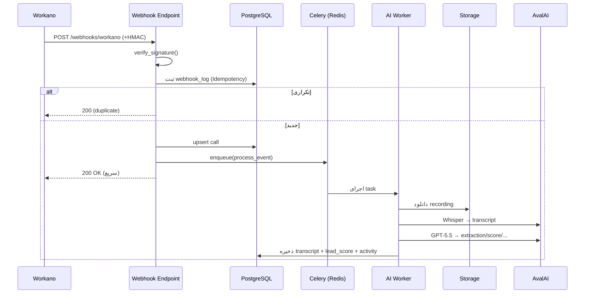

# یکپارچه‌سازی تلفنی Workano

> نسخه ۱.۰ | معماری Webhook-Driven | لایه‌ی انتزاع قابل‌تعویض

## ۱. لایه‌ی انتزاع TelephonyProvider
تمام منطق دامنه، فقط با اینترفیس `TelephonyProvider` کار می‌کند. Workano یک پیاده‌سازی است؛
در آینده `IssabelProvider`/`AsteriskProvider` بدون تغییر دامنه اضافه می‌شوند.

```python
from abc import ABC, abstractmethod

class TelephonyProvider(ABC):
    @abstractmethod
    def verify_signature(self, raw_body: bytes, headers: dict) -> bool: ...

    @abstractmethod
    def parse_event(self, payload: dict) -> "TelephonyEvent": ...

    @abstractmethod
    async def fetch_recording(self, external_call_id: str) -> bytes: ...
```

`TelephonyEvent` یک مدل دامنه‌ی خنثی نسبت به Provider است:

```python
class TelephonyEvent(BaseModel):
    provider: str
    event_type: Literal["incoming","outgoing","missed","finished","recording_ready"]
    external_call_id: str
    direction: Literal["inbound","outbound"]
    caller_number: str
    callee_number: str
    agent_extension: Optional[str]
    started_at: Optional[datetime]
    ended_at: Optional[datetime]
    duration_sec: Optional[int]
    recording_url: Optional[str]
    raw: dict
```

## ۲. رخدادهای Workano

| رخداد | event_type | اقدام در CRM |
|---|---|---|
| Incoming Call | `incoming` | ایجاد/به‌روزرسانی تماس، تطبیق با دانشجو (بر اساس موبایل) |
| Outgoing Call | `outgoing` | ثبت تماس خروجی، اتصال به کارشناس |
| Missed Call | `missed` | ثبت تماس ازدست‌رفته + ایجاد followup خودکار |
| Call Finished | `finished` | به‌روزرسانی مدت و وضعیت |
| Recording Ready | `recording_ready` | enqueue پایپ‌لاین AI (دانلود → STT → LLM) |

## ۳. جریان پردازش Webhook



> نکته‌ی کلیدی: Webhook باید **سریع** پاسخ `200` دهد؛ تمام پردازش سنگین به Celery منتقل می‌شود.

## ۴. امنیت Webhook
- **HMAC Signature:** هدر `X-Workano-Signature` با `HMAC-SHA256(secret, raw_body)` مقایسه می‌شود (constant-time).
- **IP Allowlist:** محدودسازی به رنج IP اعلام‌شده‌ی Workano.
- **Idempotency:** کلید یکتا `(provider, event_type, external_id)` در `webhook_logs`؛ رخداد تکراری نادیده.
- **Replay Protection:** بررسی timestamp رخداد (پنجره‌ی ۵ دقیقه).

## ۵. نمونه Payload و Endpoint

```http
POST /api/v1/webhooks/workano
X-Workano-Signature: sha256=ab12...
Content-Type: application/json

{
  "event": "recording_ready",
  "call_id": "wk_889921",
  "direction": "inbound",
  "from": "+989121234567",
  "to": "02191000000",
  "agent": "1024",
  "started_at": "2026-06-21T10:00:00Z",
  "ended_at": "2026-06-21T10:06:12Z",
  "duration": 372,
  "recording_url": "https://pbx.workano.cloud/rec/wk_889921.mp3"
}

200 OK
{ "status": "accepted" }
```

## ۶. افزودن Provider جدید (مثلاً Asterisk)
۱. کلاس `AsteriskProvider(TelephonyProvider)` در `infrastructure/telephony/asterisk/`.
۲. پیاده‌سازی `verify_signature`, `parse_event`, `fetch_recording`.
۳. ثبت در `TelephonyProviderFactory` با کلید `"asterisk"`.
۴. تنظیم `TELEPHONY_PROVIDER=asterisk` در Environment.
هیچ تغییری در Use Caseها یا دامنه لازم نیست (Open/Closed Principle).
