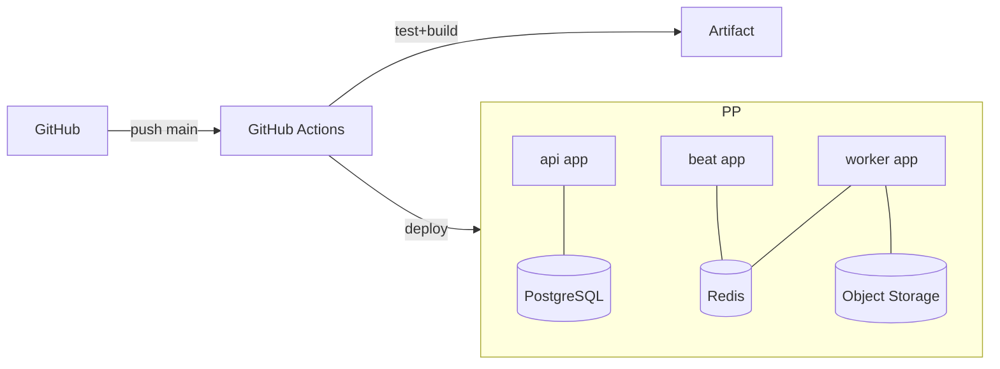

# استراتژی استقرار — Parspack PaaS + GitHub Actions

> نسخه ۱.۰ | بدون Docker | Buildpack-based | CI/CD کامل

## ۱. توپولوژی استقرار
سه «اپ» مجزا روی Parspack (هر کدام یک Process/Service):

| اپ | فرمان اجرا | مقیاس |
|---|---|---|
| **api** | `gunicorn -k uvicorn.workers.UvicornWorker app.main:app` | افقی (چند instance) |
| **worker** | `celery -A app.worker.celery_app worker -l info` | افقی |
| **beat** | `celery -A app.worker.celery_app beat -l info` | تک‌instance |

سرویس‌های Managed از Parspack: **PostgreSQL**, **Redis**, **Object Storage (S3)**.



## ۲. فایل‌های پیکربندی استقرار

### `Procfile` (Buildpack)
```Procfile
web: gunicorn -k uvicorn.workers.UvicornWorker --bind 0.0.0.0:$PORT --workers 3 app.main:app
worker: celery -A app.worker.celery_app worker --loglevel=info --concurrency=4
beat: celery -A app.worker.celery_app beat --loglevel=info
release: alembic upgrade head
```
> فاز `release` پیش از فعال‌شدن نسخه‌ی جدید، مهاجرت‌های DB را اجرا می‌کند.

### `runtime.txt`
```
python-3.12
```

### نمونه‌ی `parspack.json` / متغیرهای سرویس
تنظیمات منابع (RAM/CPU) و اتصال سرویس‌های Managed از پنل Parspack؛ مقادیر اتصال به‌صورت env تزریق می‌شوند.

## ۳. متغیرهای محیطی (Environment)
فایل [`backend/.env.example`](../backend/.env.example) مرجع کامل است. کلیدی‌ترین‌ها:
```env
APP_ENV=production
SECRET_KEY=...
DATABASE_URL=postgresql+asyncpg://...
REDIS_URL=redis://...
S3_ENDPOINT=... ; S3_BUCKET=... ; S3_ACCESS_KEY=... ; S3_SECRET_KEY=...
AVALAI_API_KEY=... ; AVALAI_BASE_URL=https://api.avalai.ir/v1
TELEPHONY_PROVIDER=workano
WORKANO_WEBHOOK_SECRET=...
JWT_ACCESS_TTL=900 ; JWT_REFRESH_TTL=604800
CORS_ORIGINS=https://crm.example.ir
```

## ۴. GitHub Actions (CI/CD)
دو Workflow: CI (تست/لینت) و Deploy. فایل‌ها در [`.github/workflows/`](../.github/workflows/).

**خلاصه‌ی pipeline:**
1. `ci.yml` (روی هر PR): نصب وابستگی، `ruff` + `mypy`، اجرای `pytest`، اسکن امنیتی (`pip-audit`).
2. `deploy.yml` (روی push به `main`): build فرانت، اجرای migration، استقرار سه اپ روی Parspack از طریق Git push/CLI، health-check.

رازها در **GitHub Secrets**: `PARSPACK_TOKEN`, `PARSPACK_APP_API`, و …

## ۵. مهاجرت دیتابیس
- با Alembic؛ در فاز `release` به‌صورت خودکار `alembic upgrade head`.
- استراتژی **Zero-Downtime**: تغییرات additive، سپس backfill، سپس حذف ستون قدیمی در نسخه‌ی بعد.

## ۶. مانیتورینگ و سلامت
- Endpoint `/healthz` (liveness) و `/readyz` (بررسی DB/Redis).
- لاگ ساختاریافته به stdout؛ جمع‌آوری از پنل Parspack.
- متریک‌های Celery (طول صف، نرخ شکست) برای هشدار.

## ۷. استراتژی Rollback
- نگه‌داشتن نسخه‌ی قبلی build؛ بازگشت سریع از پنل Parspack.
- مهاجرت‌های DB همیشه backward-compatible تا rollback اپ، DB را نشکند.
