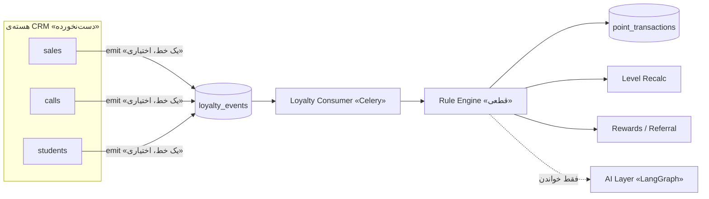

# باشگاه مشتریان و سیستم معرفی دوستان (Loyalty & Referral)

> نسخه ۱.۰ (طراحی) | ماژولِ **کاملاً مستقل و حذف‌شدنی** | backend-first، بدونِ وابستگی به UI
>
> ⚠️ این سند فقط **طراحی** است. هیچ کدی هنوز پیاده نشده. پیاده‌سازی پس از تأیید، فاز‌به‌فاز.

---

## 🎯 هدف
افزایشِ ثبت‌نامِ جدید، بازگشتِ مشتری، خریدِ دوره‌ی بعدی، و تعاملِ دانش‌آموز — از طریقِ
امتیازدهی، سطح‌بندی، پاداش و معرفیِ دوستان.

---

## 🔑 اصلِ طلاییِ این ماژول: «قابلِ حذفِ کامل، بدونِ آسیب»

این ماژول طوری طراحی شده که **هر وقت نخواستی، در چند دقیقه و بدونِ شکستنِ هیچ‌چیزی حذف شود**:

1. **کدِ ماژول کاملاً جداست:** همه‌چیز داخلِ `backend/src/modules/loyalty/` است. حذفِ ماژول =
   حذفِ همین یک پوشه + حذفِ ثبتِ routerش در `app/main.py` (یک خط).
2. **صفر importِ معکوس:** هسته‌ی CRM **هرگز** به `loyalty` وابسته نیست و آن را import نمی‌کند.
   جهتِ وابستگی همیشه `loyalty → (فقط رویداد/شناسه) → CRM` است، نه برعکس.
3. **بدونِ FK سخت به جدول‌های هسته:** جدول‌های loyalty فقط `student_id` را به‌صورتِ ارجاعِ
   **نرم** نگه می‌دارند (بدونِ `FOREIGN KEY ... REFERENCES students`). پس drop کردنِ جدول‌های
   loyalty هیچ constraintـی روی جدول‌های اصلی نمی‌شکند.
4. **جدول‌ها با پیشوندِ `loyalty_`:** حذفِ کاملِ داده = یک migration که فقط جدول‌های `loyalty_*`
   و `events` (اگر فقط برای loyalty ساخته شده) را drop می‌کند. جدول‌های اصلی دست‌نخورده.
5. **اتصالِ اختیاری با سوییچ:** یک متغیرِ محیطی `LOYALTY_ENABLED=false` کلِ ماژول را خاموش
   می‌کند (router ثبت نمی‌شود، consumer اجرا نمی‌شود) — **بدونِ حذفِ کد**. برای خاموش/روشنِ سریع.

> نتیجه: «نصب» = افزودنِ یک پوشه + یک خط router + یک migration. «حذف» = برعکسِ همین، سه قدم.
> هیچ فایلِ دیگری از پروژه لمس نمی‌شود.

### چک‌لیستِ حذفِ کامل (Uninstall)
```
1) در app/main.py خطِ include_router(loyalty_router ...) را حذف کن.
2) پوشه‌ی backend/src/modules/loyalty/ را پاک کن.
3) migration نزولی (downgrade) را اجرا کن → همه‌ی جدول‌های loyalty_* drop می‌شوند.
4) (اختیاری) اگر از حالت Outbox استفاده کردی: خطِ emit در هسته را بردار (یا فقط
   LOYALTY_ENABLED=false بگذار تا emit بی‌اثر شود).
تمام. هسته‌ی CRM بدونِ هیچ تغییری کار می‌کند.
```

---

## 🧩 جای ماژول
```
backend/src/modules/loyalty/
├── domain/          # مدل‌های خالص + رویدادها (بدون وابستگی به فریم‌ورک)
├── application/      # موتور قوانین، سرویس‌ها، ports (اینترفیس‌ها)
├── infrastructure/   # ORM، consumer، پیاده‌سازیِ providerها
└── api/              # routerها (زیر /api/v1/loyalty)
```
همان الگوی Clean Architecture سایرِ ماژول‌ها. **قانون:** دامنه به فریم‌ورک وابسته نیست؛ منابعِ
بیرونی پشتِ اینترفیس (Open/Closed).

---

## ⚠️ چرا LangGraph/LLM برای هسته «نه»؟
امتیاز و پاداش باید **قطعی، قابلِ‌حسابرسی، idempotent و ارزان** باشند (خرید = دقیقاً همان امتیاز،
همیشه). LLM غیرقطعی/گران/غیرقابلِ‌اعتماد برای «پول/امتیاز» است.

- **هسته = Rules Engine قطعی** (کد + قوانینِ JSON).
- **LangGraph فقط در لایه‌ی AI مشورتی** (بخش ۷): ریزش، پیشنهادِ کمپین/تخفیف — که فقط **پیشنهاد**
  می‌دهد و روی `LLMProvider`ِ موجودِ پروژه (AvalAI) سوار می‌شود. AI هرگز امتیاز نمی‌دهد.

---

## ۱. Data Models (جدول‌ها)

> همه با پیشوندِ `loyalty_`. `student_id` ارجاعِ **نرم** (بدونِ FK سخت) برای استقلال و حذفِ آسان.

```sql
-- حساب امتیازِ هر دانش‌آموز
loyalty_accounts (
  id             uuid PK DEFAULT gen_random_uuid(),
  student_id     uuid UNIQUE,          -- ارجاع نرم به students (بدون FK)
  points_balance int  NOT NULL DEFAULT 0,   -- موجودیِ قابلِ‌خرج
  points_lifetime int NOT NULL DEFAULT 0,   -- کلِ کسب‌شده (مبنای سطح)
  level          text NOT NULL DEFAULT 'bronze',
  referral_code  text UNIQUE,          -- کدِ دعوتِ اختصاصی
  referred_by    uuid,                 -- loyalty_accounts.id معرف
  birthday       date,
  created_at     timestamptz NOT NULL DEFAULT now(),
  updated_at     timestamptz NOT NULL DEFAULT now()
)

-- دفترِ کل امتیاز (Ledger) — منبعِ حقیقت
loyalty_point_transactions (
  id              uuid PK DEFAULT gen_random_uuid(),
  account_id      uuid,                -- loyalty_accounts.id (نرم)
  delta           int  NOT NULL,       -- + یا -
  reason          text,               -- کدِ ruleِ اجراشده
  event_id        uuid,
  rule_id         uuid,
  idempotency_key text UNIQUE,         -- (event_id + rule_id) → ضدِ دوباره‌شماری
  meta            jsonb,
  created_at      timestamptz NOT NULL DEFAULT now()
)

-- سطوح (پیکربندی، نه هاردکد)
loyalty_levels (
  key         text PK,                 -- bronze/silver/gold/platinum
  title       text,
  min_points  int  NOT NULL,
  order_index int  NOT NULL,
  benefits    jsonb                    -- [{type:'discount',value:10},{type:'priority_support'}]
)

-- قوانینِ امتیازدهی (JSON-محور، نسخه‌دار)
loyalty_rules (
  id         uuid PK DEFAULT gen_random_uuid(),
  key        text UNIQUE,
  event_type text,                     -- 'purchase.created'
  definition jsonb,                    -- schema بخش ۲
  priority   int  NOT NULL DEFAULT 100,
  is_active  bool NOT NULL DEFAULT true,
  version    int  NOT NULL DEFAULT 1,
  valid_from timestamptz, valid_to timestamptz,
  created_at timestamptz NOT NULL DEFAULT now()
)

-- کاتالوگِ پاداش
loyalty_rewards (
  id          uuid PK DEFAULT gen_random_uuid(),
  key         text, title text,
  cost_points int  NOT NULL,           -- 1000, 1500, 2000, 3000
  type        text NOT NULL,           -- free_session|discount|free_course|coupon
  payload     jsonb,                   -- {percent:10} یا {course_id:...}
  min_level   text, stock int,
  is_active   bool NOT NULL DEFAULT true
)

-- مصرفِ پاداش
loyalty_redemptions (
  id           uuid PK DEFAULT gen_random_uuid(),
  account_id   uuid, reward_id uuid,
  points_spent int  NOT NULL,
  status       text NOT NULL DEFAULT 'pending', -- pending|approved|fulfilled|expired|canceled
  coupon_code  text, expires_at timestamptz,
  created_at   timestamptz NOT NULL DEFAULT now()
)

-- معرفی دوستان
loyalty_referrals (
  id                 uuid PK DEFAULT gen_random_uuid(),
  referrer_account_id uuid,
  referred_student_id uuid,
  code_used          text,
  status             text NOT NULL DEFAULT 'pending', -- pending|registered|purchased
  signup_rewarded    bool NOT NULL DEFAULT false,
  purchase_rewarded  bool NOT NULL DEFAULT false,
  created_at         timestamptz NOT NULL DEFAULT now()
)

-- Outbox رویدادها (زیرساختِ اتصال؛ فقط اگر حالت Outbox انتخاب شود)
loyalty_events (
  id           uuid PK DEFAULT gen_random_uuid(),
  type         text NOT NULL,          -- purchase.created / call.completed / ...
  entity       text, entity_id uuid,
  student_id   uuid,
  payload      jsonb,
  occurred_at  timestamptz NOT NULL DEFAULT now(),
  processed_at timestamptz,            -- برای مصرفِ idempotent
  dedup_key    text UNIQUE
)
```

**اصلِ Ledger:** موجودی (`points_balance`) از جمعِ `loyalty_point_transactions` می‌آید (کش‌شده
روی account برای سرعت). `idempotency_key` تضمین می‌کند یک رویداد هرگز دوبار امتیاز نمی‌دهد.

---

## ۲. Rule Engine + JSON Schema

موتورِ **قطعیِ داده‌محور**. هر rule: «روی کدام رویداد، با چه شرطی، چقدر امتیاز/چه اکشن».

```jsonc
{
  "key": "purchase_points",
  "on": "purchase.created",
  "when": [                                   // AND — همه true شوند
    { "field": "amount", "op": ">=", "value": 1000000 }
  ],
  "compute": {                                // نوع محاسبه
    "type": "tiered",                         // fixed | ratio | tiered | expr
    "expr": "min(1000, floor(amount / 100000) * 10)"
  },
  "actions": [                                // اکشن‌های جانبی (plugin)
    { "type": "award_points" },
    { "type": "maybe_bonus", "params": { "if_nth_purchase": 2, "bonus": 200 } }
  ],
  "idempotent_by": ["event_id"],
  "cooldown": null                            // مثلاً "1/day" برای ورود روزانه
}
```

- `compute.type`: `fixed` (تماس موفق +۱۰)، `ratio` (۱ به‌ازای X تومان)، `tiered` (پله‌ای)،
  `expr` (فرمولِ امنِ sandbox — نه کدِ دلخواه).
- `op`: `== != > >= < <= in between`.
- **افزونه‌پذیری:** هر `action` یک pluginِ ثبت‌شده است (`award_points`, `grant_reward`,
  `apply_discount`, `send_notification`, `trigger_campaign`) → رفتارِ جدید بدونِ تغییرِ هسته.

### نگاشتِ رفتارها به قوانین (پیش‌فرض)
| رویداد | rule | امتیاز |
|---|---|---|
| `call.completed` outcome=successful | call_success | +۱۰ |
| `call.completed` answered | call_answered | +۵ |
| `call.completed` missed | call_missed | −۵ |
| `purchase.created` | purchase_points | +۱۰۰..۱۰۰۰ (نسبتِ مبلغ) |
| خرید دوم | purchase_2nd_bonus | +۲۰۰ |
| `referral.registered` | referral_signup | معرف +۳۰۰ |
| `referral.purchased` | referral_purchase | معرف +۵۰۰ |
| `birthday.triggered` | birthday | +۱۰۰ + کوپن |
| `panel.login` (روزانه) | daily_login | +۲ (cooldown=1/day) |
| `form.completed` | form_completed | +۱۰ |

---

## ۳. Event Flow
```
رویداد رخ می‌دهد (purchase.created)
  → outbox.insert(event, dedup_key)                      [حالت Outbox]
  → Celery consumer رویدادهای processed_at=null را می‌گیرد
  → rules(event_type, is_active, در بازه) به‌ترتیب priority
  → هر rule: when؟ → compute → point_transaction(idempotency_key)
  → recompute level → اگر ارتقا: level_up → مزایا/نوتیف
  → actions (پاداش/معرفی/کمپین)
  → event.processed_at = now
```



### دو حالتِ اتصال (هر دو حذف‌شدنی)
- **الف) Outbox (تمیزتر):** هسته یک `emit(event)` صدا می‌زند (یک خط، پشتِ گاردِ `LOYALTY_ENABLED`).
  حذفِ ماژول → این خط بی‌اثر/حذف. رویدادهای بی‌مصرف بی‌خطرند.
- **ب) Projection «صفر-دست‌زدن به هسته»:** یک Celery-beatِ loyalty هر چند دقیقه جدول‌های
  `sales/calls/students` را از آخرین checkpoint می‌خواند و خودش رویداد می‌سازد. **هیچ خطی به
  هسته اضافه نمی‌شود** — کاملاً مناسبِ «هر وقت خواستم راحت حذف کنم».

> پیشنهاد: **حالت ب** برای اولین نسخه، چون تضمینِ صفرِ تغییر در CRM اصلی است.

---

## ۴. Referral Flow
```
معرف کدش را می‌دهد → دوست با ?ref=CODE ثبت‌نام
  → student.created (referred_by)
  → referral(status=registered): معرف +۳۰۰ · دوست ۵٪ تخفیفِ اولیه (coupon)
دوست خرید می‌کند → purchase.created
  → اگر purchase_rewarded=false: معرف +۵۰۰، flag=true
```
ضدِتقلب: کدِ خودی ممنوع، سقفِ معرفی در بازه، پاداشِ خرید فقط یک‌بار.

---

## ۵. API Endpoints (زیر `/api/v1/loyalty`)
```
GET   /accounts/{student_id}                 پروفایل امتیاز + سطح + کد دعوت
GET   /accounts/{student_id}/transactions    دفترِ امتیاز
GET   /leaderboard                           باارزش‌ترین‌ها
POST  /referrals/apply                        {code, new_student_id}
GET   /rewards                                کاتالوگ (فیلترِ سطح)
POST  /rewards/{id}/redeem                    خرجِ امتیاز → کوپن/رزرو
GET   /redemptions/{student_id}
-- admin --
GET/POST/PATCH /rules · /levels · /rewards
POST  /events                                 تزریقِ دستیِ رویداد (تست/بک‌فیل)
-- AI (اختیاری) --
GET   /ai/churn-risk · /ai/high-value · /ai/discount-suggestions · /ai/campaign
```

> این routerها فقط وقتی ثبت می‌شوند که `LOYALTY_ENABLED=true`. در `main.py` یک بلاکِ شرطی:
> `if settings.loyalty_enabled: app.include_router(loyalty_router, prefix=f"{API}/loyalty")`.

---

## ۶. AI Layer (اینجا LangGraph درست است — و کاملاً جدا)
ماژولِ مشورتیِ **فقط-خواندنی** (هیچ امتیازی نمی‌دهد):
- **ریزش (churn):** heuristic/ML روی (روزهای بی‌تعامل، افتِ نرخ، سطح) → نمره‌ی ریسک.
- **باارزش‌ها (CLV):** جمعِ خرید + دفعات + سطح.
- **پیشنهادِ کمپین/تخفیف:** یک **LangGraph agent** روی `LLMProvider`ِ موجود؛ ورودی = خروجیِ
  قطعیِ بالا، خروجی = متنِ کمپین/سگمنت → به Marketing Automation وصل می‌شود.
اصل: AI فقط **پیشنهاد**؛ اجرا با ruleهای قطعی. حذفِ AI هم مستقل است (زیرپوشه‌ی جدا).

---

## ۷. افزونه‌پذیری (Plugin-based)
سه نقطه‌ی توسعه پشتِ اینترفیس:
- `RuleType` (نوعِ محاسبه‌ی جدید) · `ActionHandler` (اکشنِ جدید) · `EventSource` (منبعِ رویدادِ جدید).
- Rewards و Levels **دیتا** هستند (نه کد) → افزودن بدونِ deploy.
- آماده‌ی آینده: Campaigns، Automation، AI Agent — همه از طریقِ همین Event Bus + Actionها.

---

## ۸. فازبندیِ پیشنهادیِ پیاده‌سازی
| فاز | خروجی | AI؟ |
|---|---|---|
| ۱ | جدول‌ها + `loyalty_accounts` + Ledger + Rule Engine + رویدادهای پایه (call/purchase) + level | ❌ |
| ۲ | Rewards + Redemption + Referral کامل | ❌ |
| ۳ | تولد/ورود روزانه/فرم + leaderboard + endpointهای admin برای قوانین | ❌ |
| ۴ | لایه‌ی AI (ریزش/کمپین با LangGraph) | ✅ |

> هر فاز مستقل و حذف‌شدنی. می‌توان روی فاز ۱ ایستاد و بقیه را هرگز نساخت.

---

## جمع‌بندی
| موضوع | تصمیم |
|---|---|
| موتورِ امتیاز/سطح/پاداش/معرفی | **Rules Engine قطعی** (کد + JSON) — نه LLM |
| اتصال به CRM | Event Bus/Outbox یا Projection — **بدونِ تغییرِ هسته** |
| استقلال/حذف | پوشه‌ی مستقل + بدون FK سخت + سوییچِ `LOYALTY_ENABLED` + downgrade تمیز |
| ذخیره | همان PostgreSQL/Redis/Celery پروژه |
| AI مشورتی | **LangGraph** روی `LLMProvider` موجود، در زیرپوشه‌ی جدا |
